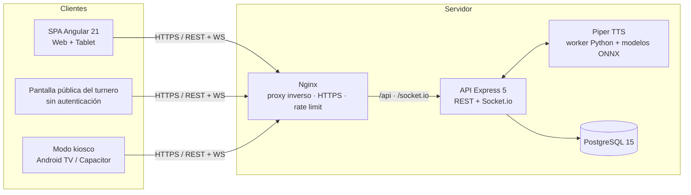

# 🏥 Sistema Clínica — Gestión de Turnos y Atención

Sistema integral de gestión clínica para centros de salud con **turnero electrónico en tiempo real**, admisión (APS), atención médica, laboratorio, imágenes, administración de personal/roles/permisos, anuncios por voz y pantalla pública de sala de espera con soporte de **modo kiosco** para Android TV.

> **Stack:** Angular 21 (standalone) · Node.js/Express 5 · PostgreSQL 15 · Socket.io · Piper TTS · Nginx · Docker

---

## 📑 Tabla de contenidos

- [Características](#características)
- [Arquitectura](#arquitectura)
- [Módulos y rutas](#módulos-y-rutas)
- [Roles y permisos](#roles-y-permisos)
- [Máquina de estados](#máquina-de-estados)
- [Anuncios por voz (TTS)](#anuncios-por-voz-tts-con-piper)
- [Modo kiosco y app Android](#modo-kiosco-y-app-android-capacitor)
- [Stack tecnológico](#stack-tecnológico)
- [Requisitos](#requisitos)
- [Puesta en marcha (desarrollo)](#puesta-en-marcha-desarrollo)
- [Despliegue con Docker](#despliegue-con-docker)
- [Estructura del proyecto](#estructura-del-proyecto)
- [Variables de entorno](#variables-de-entorno)
- [Scripts](#scripts)
- [Documentación de la API](#documentación-de-la-api)
- [Seguridad](#seguridad)
- [Verificación y CI](#verificación-y-ci)
- [Licencia](#licencia)

---

## ✨ Características

- **Turnero electrónico público**: pantalla de sala de espera con llamadas por voz, dividida por sedes (Plaza Sucre, Santa Mónica), actualizada en tiempo real vía WebSocket.
- **Anuncios por voz con Piper TTS**: síntesis local (modelos ONNX en español), anuncio con piso antepuesto al número (ej. **M01**), audio pre-sintetizado y sincronizado entre pantallas, y cola de prioridad para llamadas médicas.
- **Admisión / APS**: registro de pacientes, asignación de turnos, pase a caja y sala de espera, gestión de ausencias y reincorporación.
- **Atención médica**: cola de pacientes por consultorio, llamar siguiente, inicio y finalización de atención.
- **Laboratorio e Imágenes**: flujo de caja → sala de espera → atención, reutilizando el componente de atención con `tipo` (`laboratorio` / `imagenes`).
- **Aseguradoras**: catálogo de aseguradoras (reutiliza la recepción en modo `aseguradorasMode`).
- **Administración**: gestión de personal, roles por sede, permisología granular, especialidades, consultorios y reportes (PDF / Excel).
- **Multi-sede**: roles, consultorios y turnos aislados por sede (`id_sede`); pisos de especialidades y consultorios para guiar al paciente.
- **Múltiples roles por usuario** (tabla puente `Usuario_Rol`) y **múltiples especialidades por médico** (`Usuario_Especialidad`, con consultorio por especialidad).
- **Numeración atómica de turnos** por día, sede y servicio (tabla `Secuencia_Turnos`, inmune a concurrencia y a borrados).
- **Modo kiosco** sin login para Android TV / tablet y **app Android** (Capacitor) con reproducción de voz nativa.
- **Seguridad**: JWT con refresh token, rate limiting, Helmet, auditoría, sanitización de entradas y logs estructurados.

---

## 🏗️ Arquitectura



### Flujo de datos en tiempo real

1. El **backend** publica eventos por **Socket.io** (nuevos turnos, llamados, cambios de estado, liberaciones).
2. El **frontend** (turnero y módulos de atención) se suscribe y actualiza la interfaz sin recargar.
3. La pantalla pública del turnero (`/turnero/:sede`) y el modo kiosco (`/kiosk/:sede`) son rutas **sin autenticación** que solo reciben eventos y datos no sensibles (nombre, apellido, turno, estado).
4. Los **anuncios de voz** se pre-sintetizan en el backend con Piper y se sirven por `GET /api/tts/audio/:archivo`, de modo que todas las pantallas del turnero reproducen el mismo audio en sincronía.

### Eventos de Socket.io

| Evento | Significado |
|--------|-------------|
| `nuevo-llamado` | Se llamó a un paciente a un consultorio/servicio (activa anuncio de voz + turnero) |
| `estado-actualizado` | Cambio de estado, con `tipo`: `nuevo-turno`, `estado-cambiado`, `retirado`, `ausente`, `liberacion` |
| `permisos-actualizados` · `rol-cambiado` · `rol-desactivado` · `sede-cambiada` · `usuario-desactivado` · `sesion-cerrada` · `especialidad-desactivada` | Cambios administrativos que fuerzan recarga o cierre de sesión en los clientes conectados |

---

## 🧩 Módulos y rutas

| Ruta | Módulo | Descripción | Acceso |
|------|--------|-------------|--------|
| `/` | Inicio | Redirección según rol | Autenticado |
| `/login` | Login | Autenticación con JWT | Público |
| `/turnero` · `/turnero/:sede` | Turnero | Pantalla pública de sala de espera (voz) | Público |
| `/kiosk` · `/kiosk/:sede` | Turnero kiosco | Modo kiosco sin login para Android TV / tablet | Público |
| `/recepcion` | Recepción | Registro y turnos de admisión | `admision` |
| `/aseguradoras` | Aseguradoras | Gestión de aseguradoras (reutiliza recepción en modo `aseguradorasMode`) | `aseguradoras` |
| `/aps` | APS (Admisión) | Alta de pacientes, edición, ausencias | `aps` |
| `/atencion` | Atención médica | Cola y consulta por consultorio (`tipo: medico`) | `atencion_medica` |
| `/atencion-laboratorio` | Atención laboratorio | Flujo de atención de laboratorio | `laboratorio` |
| `/atencion-imagenes` | Atención imágenes | Flujo de atención de imágenes | `imagenes` |
| `/laboratorio` | Laboratorio | Caja y sala de espera de laboratorio | `laboratorio` |
| `/imagenes` | Imágenes | Caja y sala de espera de imágenes | `imagenes` |
| `/administrador` | Administración | Personal, roles, permisología, especialidades, reportes | `personal` / `roles` / `permisologia` / `especialidades` / `reportes` |

> **Nota:** `/atencion-laboratorio` y `/atencion-imagenes` reutilizan el mismo componente de atención con un parámetro `tipo`, igual que `/aseguradoras` reutiliza recepción. Todas las rutas administrativas están protegidas por `authGuard` + `modulePermissionGuard`.

---

## 👥 Roles y permisos

Los roles son **por sede** (`key + id_sede` únicos). Roles precargados por sede en `backend/db/init.sql`:

| Rol | Key | Módulos típicos |
|-----|-----|-----------------|
| Administrador | `administrador` | Todos (`personal`, `roles`, `permisologia`, `especialidades`, `reportes`, `llamado`, …) |
| Recepcionista | `recepcionista` | `admision` |
| Médico | `medico` | `atencion_medica` |
| Coordinador | `coordinador` | `aps` (incluye marcar ausente, presupuesto, claves) |
| Analista | `analista` | `aps` + `aseguradoras` |
| Laboratorio | `laboratorio` | `laboratorio` + llamado de laboratorio |
| Imágenes | `imagenes` | `imagenes` + llamado de imágenes |
| Enfermero | `enfermero` | `admision` |

Los permisos siguen el patrón `<recurso>:<accion>` (ej. `admision:crear`, `atencion_medica:llamar_siguiente`, `laboratorio:*`) y se agrupan en *sets* predefinidos (`backend/src/config/permission-sets.js`) que el administrador asigna a cada rol. Un usuario puede tener **varios roles a la vez** (tabla `Usuario_Rol`). La validación en tiempo real ocurre en `backend/src/middleware/permission.js` y en el guard Angular `modulePermissionGuard`.

---

## 🔄 Máquina de estados

El flujo de un paciente se modela con la tabla `Estado` (9 estados):

```
Registrado (1) → En Caja (2) → Sala de Espera (3) → Llamado (4) → En Atencion (5) → Atendido (6)
      │               │               │                  │              │
      │               │               │                  └── Ausente (7) ──→ Reincorporar → Sala de Espera
      │               │               └── Ausente (7) ──→ Reincorporar ──┘
      │               │
      └── Retirado (9) ┘              Espera de clave (8) → En Atencion (5)
```

| # | Estado | Uso |
|---|--------|-----|
| 1 | Registrado | Paciente recién registrado en admisión |
| 2 | En Caja | En cola para caja |
| 3 | Sala de Espera | Esperando el llamado |
| 4 | Llamado | Fue llamado al consultorio/servicio |
| 5 | En Atencion | Siendo atendido |
| 6 | Atendido | Atención finalizada |
| 7 | Ausente | No respondió al llamado (marcar ausente) |
| 8 | Espera de clave | Esperando clave/resultado intermedio |
| 9 | Retirado | Se retiró del establecimiento |

> Las transiciones se ejecutan con **transacciones SQL** (`FOR UPDATE` / `SKIP LOCKED`) para evitar carreras entre usuarios, y la numeración de turnos es **atómica** por sede y servicio (secuencia diaria en `Secuencia_Turnos`). Ver `backend/src/repositories/atencion.repository.js`.

---

## 🔊 Anuncios por voz (TTS con Piper)

El turnero anuncia los llamados por voz usando **Piper TTS** (síntesis local, sin servicios externos):

- **Worker persistente** (`backend/scripts/piper_worker.py`): carga el modelo ONNX una sola vez y queda escuchando peticiones por stdin/stdout, de modo que el primer anuncio tarda el arranque (~4-5 s) y los siguientes salen casi al instante.
- **Modelos** en `piper/models/`: `es_MX-claude-high.onnx` (principal) y `es_ES-sharvard-medium.onnx`.
- **Sincronización entre pantallas**: el backend pre-sintetiza el audio antes de emitir el evento y lo sirve por `GET /api/tts/audio/:archivo`; todas las pantallas del turnero reproducen el mismo WAV a la vez.
- **Cola con prioridad**: las llamadas de atención médica (`prioridad: 'alta'`) se procesan antes que las de laboratorio/imágenes, para que la voz del médico nunca quede bloqueada.
- **Piso antepuesto**: el anuncio usa el piso de la especialidad del turno (configurado en Especialidades, ej. **M** de mezanina) con respaldo al piso físico del consultorio (`M01`).
- **Fallbacks**: si Piper no está disponible, el navegador usa la **Web Speech API** y la app Android usa `@capacitor-community/text-to-speech`.
- **Rutas públicas** (`GET /api/tts/health`, `POST /api/tts`, `GET /api/tts/audio/:archivo`) — excluidas del rate limiter general por ser del turnero público.

> Piper se ejecuta en el host (Python + binarios ONNX en `piper/`); **no está incluido en la imagen Docker** (el `Dockerfile.backend` solo copia `backend/`). En despliegues contenedorizados sin Piper, los anuncios usan el fallback del navegador.

---

## 📺 Modo kiosco y app Android (Capacitor)

- **Modo kiosco**: rutas `/kiosk` y `/kiosk/:sede` (`src/app/features/turnero/turnero-kiosk`) sin login, pensadas para Android TV/tablet con sede automática.
- **App Android**: configurada en `capacitor.config.ts` (app **Turnero CNC**, `com.clinicanuevacaracas.turnero`) con `@capacitor-community/text-to-speech` para la voz nativa.
- **Scripts de operación** en `scripts/`: `iniciar-turnero.bat` / `iniciar-turnero.sh` lanzan el turnero en modo kiosco y `habilitar-autoplay-turnero.reg` habilita el autoplay de audio en Windows.

---

## 🛠️ Stack tecnológico

| Capa | Tecnología |
|------|------------|
| Frontend | Angular 21 (standalone, lazy loading), Tailwind CSS, Lucide (lucide-angular), SweetAlert2, jsPDF + jspdf-autotable, SheetJS (xlsx), Capacitor 8 + text-to-speech |
| Backend | Node.js 20+, Express 5, Socket.io, bcryptjs, jsonwebtoken, express-validator, express-rate-limit, helmet, winston, prom-client, nodemailer, swagger-jsdoc + swagger-ui-express |
| Base de datos | PostgreSQL 15, `pg` (node-postgres); migraciones idempotentes automáticas (`backend/migrate.js`) + esquema semilla (`backend/db/init.sql`) |
| Voz | Piper TTS (modelos ONNX en español) + worker Python persistente |
| Infraestructura | Nginx (proxy inverso + HTTPS + rate limiting), Docker Compose, GitHub Actions (CI) |

---

## 📋 Requisitos

- Node.js **20+** y npm
- PostgreSQL **15+**
- Docker + Docker Compose (para despliegue contenedorizado)
- Piper TTS (opcional, para voz local): Python con el modelo ONNX en `piper/models/` y `PIPER_PYTHON` apuntando al ejecutable
- Navegador moderno (Chrome, Edge, Firefox)

---

## 🚀 Puesta en marcha (desarrollo)

```bash
# 1. Clonar el repositorio
git clone <repo-url>
cd sistema-clinica

# 2. Configurar variables de entorno
cp .env.example .env
cp backend/.env.example backend/.env
# Editar backend/.env con credenciales reales (DB, JWT_SECRET, SMTP…)

# 3. Instalar dependencias
npm install

# 4. Crear la base de datos e inicializar el esquema
createdb clinica_colas
psql -d clinica_colas -f backend/db/init.sql     # esquema + datos semilla

# 5. Iniciar en desarrollo (Angular :4200 + API :3001)
npm start
```

> El backend **ejecuta las migraciones automáticamente** al arrancar (y también con `npm run migrate`), así que no hace falta un paso manual adicional.

> **Endpoint de desarrollo:** `POST /api/dev/token/:id` genera un JWT para un usuario por ID (solo fuera de producción). Útil para probar la pantalla pública.

---

## 🐳 Despliegue con Docker

```bash
# Configurar secretos (obligatorios)
export DB_PASSWORD=tu_password_seguro
export JWT_SECRET=tu_secreto_jwt

# (Opcional) dominio para Nginx
export NGINX_DOMAIN=clinica.midominio.com

# Levantar todos los servicios
docker compose up -d
```

| Servicio | Puerto | Descripción |
|----------|--------|-------------|
| `db` | `5432` | PostgreSQL 15 (esquema semilla aplicado en el primer arranque) |
| `api` | `3000` | API Express (migraciones automáticas al iniciar) |
| `web` | `80` | Frontend Angular servido por Nginx |
| `integration_test` | — | Contenedor efímero que ejecuta el flujo completo del turnero (`backend/db/test_full_flow.js`) al levantar el stack |

> **Nota:** la imagen Docker del backend no incluye Piper TTS (los modelos viven en `piper/`, fuera del contexto copiado). Para voz en contenedores, monta `piper/` y define `PIPER_PYTHON`/`PIPER_MODEL`, o usa el fallback del navegador.

### Producción con HTTPS

1. Descomentar el bloque `server` HTTPS en `nginx.conf` y colocar los certificados en `/etc/nginx/ssl/fullchain.pem` y `/etc/nginx/ssl/privkey.pem` (dentro del contenedor `web`).
2. Definir `NGINX_DOMAIN` (el entrypoint sustituye la variable en la plantilla; el bloque HTTP redirige a HTTPS automáticamente).
3. Configurar `CORS_ORIGIN` con el dominio real:

```bash
CORS_ORIGIN=https://midominio.com,https://admin.midominio.com docker compose up -d
```

---

## 📁 Estructura del proyecto

```
├── backend/                        # API REST + WebSocket
│   ├── db/
│   │   ├── init.sql                # Esquema base + datos semilla (sedes, roles, estados…)
│   │   └── test_full_flow.js       # Prueba de integración del flujo del turnero
│   ├── scripts/
│   │   ├── piper_worker.py         # Worker persistente de Piper TTS
│   │   └── backup.bat              # Backup de la BD
│   ├── src/
│   │   ├── config/                 # DB pool, logger, swagger, rate limit, permission-sets
│   │   ├── controllers/            # Lógica de endpoints (auth, admin, turnos, recepción…)
│   │   ├── middleware/             # Auth JWT, permisos, auditoría, métricas, rate limit, requestId
│   │   ├── repositories/           # Capa de acceso a datos (SQL con parámetros)
│   │   ├── routes/                 # Definición de rutas Express (auth, admin, turnos, tts…)
│   │   ├── services/               # TTS (piperWorker, tts.service) y helpers
│   │   └── utils/                  # Sanitización de logs, etc.
│   ├── migrate.js                  # Migraciones idempotentes (automáticas al arrancar)
│   └── index.js                    # Punto de entrada de la API (Express + Socket.io)
├── src/                            # Frontend Angular
│   └── app/
│       ├── core/                   # Servicios, guards, interceptors, modelos, config de permisos
│       ├── features/               # Módulos: login, admin, recepcion, aps, atencion,
│       │                           #   laboratorio, imagenes, turnero, inicio
│       └── shared/                 # Componentes/pipes compartidos (sidebar, pagination…)
├── piper/                          # Modelos ONNX de TTS + runtime onnxruntime
├── scripts/                        # Operación: backup, SSL, kiosco del turnero, autoplay
├── android/                        # Proyecto Android (Capacitor, app "Turnero CNC")
├── nginx.conf                      # Plantilla de Nginx (proxy inverso, HTTPS, rate limiting)
├── docker-compose.yml              # PostgreSQL + API + Nginx + test de integración
├── Dockerfile.backend / .frontend  # Builds multi-stage
├── capacitor.config.ts             # Configuración de la app Android (Capacitor)
├── proxy.conf.js                   # Proxy de desarrollo (Angular → API)
└── .env.example                    # Plantillas de variables de entorno
```

---

## 🔑 Variables de entorno

Plantillas completas y comentadas en `.env.example` (raíz) y `backend/.env.example` (API). Variables principales:

| Variable | Descripción | Ejemplo |
|----------|-------------|---------|
| `PORT` | Puerto del backend | `3001` |
| `NODE_ENV` | Entorno de ejecución (`development` / `production`) | `development` |
| `DB_HOST` / `DB_PORT` | Host y puerto de PostgreSQL | `localhost` / `5432` |
| `DB_USER` / `DB_PASSWORD` | Credenciales de la BD | `postgres` / *(secreto)* |
| `DB_NAME` | Nombre de la base de datos | `clinica_colas` |
| `JWT_SECRET` | Secreto para firmar tokens JWT | *(secreto)* |
| `CORS_ORIGIN` | Orígenes permitidos (separados por coma) | `http://localhost:4200,http://localhost` |
| `EMAIL_HOST` / `EMAIL_PORT` | Servidor SMTP para recuperación de contraseña | `smtp.gmail.com` / `587` |
| `EMAIL_USER` / `EMAIL_PASS` | Credenciales SMTP (App Password) | *(secreto)* |
| `EMAIL_FROM` | Remitente de los correos | `"Clínica Nueva Caracas"` |
| `RATE_LIMIT_WINDOW_MS` / `RATE_LIMIT_MAX` | Ventana y máximo de peticiones por IP | `60000` / `60` |
| `PIPER_PYTHON` / `PIPER_MODEL` | Ejecutable de Python y modelo ONNX de Piper (opcionales, con defaults) | `./piper/piper-env/Scripts/python.exe` |
| `PIPER_SENTENCE_SILENCE` | Silencio entre frases del anuncio (segundos) | `0.5` |
| `NGINX_DOMAIN` | Dominio para Nginx (solo Docker) | `clinica.midominio.com` |

---

## 📜 Scripts

| Script | Descripción |
|--------|-------------|
| `npm start` | Frontend (:4200) + API (:3001) en paralelo (concurrently) |
| `npm run start:backend` | Solo API con nodemon (hot reload) |
| `npm run build` | Build de producción del frontend (Angular) |
| `npm run watch` | Build en modo watch (desarrollo) |
| `npm run migrate` | Ejecuta las migraciones idempotentes (`backend/migrate.js`) |

**Scripts de operación** (`scripts/`):

| Script | Uso |
|--------|-----|
| `backup-db.ps1` | Backup de PostgreSQL a archivo |
| `ssl-init.ps1` | Genera certificados SSL para desarrollo |
| `iniciar-turnero.bat` / `.sh` | Lanza el turnero en modo kiosco |
| `habilitar-autoplay-turnero.reg` | Habilita autoplay de audio en Windows para el turnero |

---

## 📚 Documentación de la API

- **Swagger UI** (solo desarrollo): `http://localhost:3001/api/docs`
- **Health check**: `GET /api/health`
- **Métricas Prometheus**: `GET /api/metrics`

### Endpoints principales

| Método | Ruta | Descripción |
|--------|------|-------------|
| `POST` | `/api/auth/login` | Autenticación (JWT + refresh token) |
| `POST` | `/api/auth/refresh` | Renovar access token |
| `POST` | `/api/auth/recuperacion/solicitar` | Solicitar OTP de recuperación (email) |
| `POST` | `/api/auth/recuperacion/verificar` | Validar el OTP recibido |
| `POST` | `/api/auth/recuperacion/restablecer` | Restablecer la contraseña |
| `GET` | `/api/turnero/pacientes` · `/sala-espera` · `/ultimo-llamado` | Pantalla pública del turnero (**sin auth**) |
| `POST` / `GET` | `/api/tts` · `/api/tts/audio/:archivo` · `/api/tts/health` | Síntesis y reproducción de voz (**sin auth**) |
| `GET/POST/PUT/DELETE` | `/api/admin/*` | Personal, roles, permisología, especialidades |
| `GET/POST/PUT` | `/api/turnos/*` | Registro de pacientes y cambios de estado |
| `GET/POST/PUT` | `/api/recepcion/*`, `/api/consultorios/*`, `/api/especialidades/*`, `/api/shared/*` | Flujos por módulo y recursos compartidos |
| `POST` | `/api/dev/token/:id` | Token JWT de desarrollo por ID de usuario (**solo fuera de producción**) |

> Todos los endpoints (excepto los públicos del turnero, TTS y las rutas de auth/recuperación) requieren el header `Authorization: Bearer <token>`.

---

## 🔒 Seguridad

- **JWT** con expiración de 24 h + **refresh token** persistido en BD (hash en `Refresh_Tokens`).
- **Rate limiting** por IP en login, en la recuperación de contraseña (OTP) y en la API general (`express-rate-limit` + zonas en Nginx).
- **Helmet** (headers HTTP seguros) + headers de seguridad en Nginx (HSTS, CSP, X-Frame-Options…).
- **Inyección SQL** mitigada con consultas parametrizadas (`pg` con `$1, $2…`).
- **CORS** dinámico desde `CORS_ORIGIN`.
- **Sanitización** de entradas en logs (`backend/src/utils/sanitize.js`) y validación con `express-validator`.
- **Auditoría** de acciones sensibles (`middleware/audit.js`).
- **Logs estructurados** con Winston, ID de request para trazabilidad y apagado *graceful*.

---

## ✅ Verificación y CI

```bash
# Build de producción del frontend
npm run build

# Verificación rápida de sintaxis/compilación
node --check backend/index.js
npx tsc --noEmit -p tsconfig.app.json

# Prueba de integración del flujo completo del turnero
# (se ejecuta automáticamente en Docker con `docker compose up`)
node backend/db/test_full_flow.js
```

La **CI** (GitHub Actions, `.github/workflows/ci.yml`) compila el frontend en modo producción en cada push a `main`/`develop` y en PRs hacia `main`. El trabajo de lint está temporalmente deshabilitado a la espera de migrar ESLint a `eslint.config.js`.

---

## 📄 Licencia

Uso interno.
